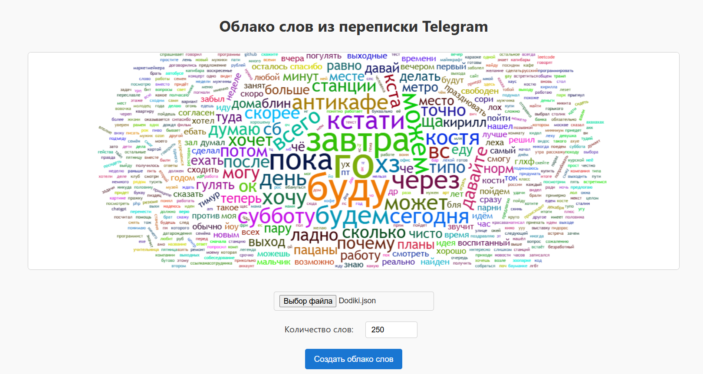
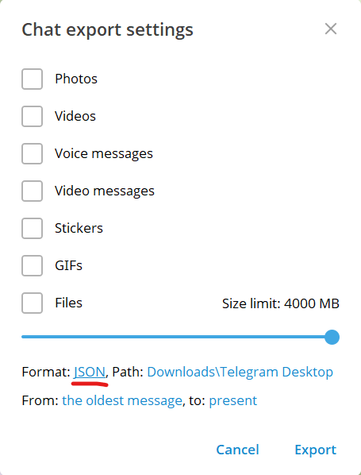

# Облако слов

[Сайт для визуализации](https://tirkirill.github.io/TelegramWordsCloud/)

## Описание

Анализ частоты слов в Telegram-чатах с визуализацией в виде облака слов по json файлу

[Есть похожий репозиторий, но я о нем не знал и он работает на python, а не в браузере](https://github.com/Manshooo/telegram-wordcloud)

## Как использовать

1. Выгрузите данные переписки телеграм в виде json

2. Перейдите на [сайт](https://tirkirill.github.io/TelegramWordsCloud/)

3. Загрузите JSON-файл с экспортом сообщений из Telegram с помощью кнопки «Выбрать файл» (result.json в папке выгрузки)

4. Укажите желаемое количество слов для облака (от 100 до 1000)

5. Нажмите кнопку «Создать облако слов».

6. Чтобы скачать картинку нажмите кнопку "Сохранить"

## Как выгрузить переписку

Выберите чат (личный или групповой), который хотите экспортировать.

Нажмите на три точки в правом верхнем углу окна чата и выберите «Экспорт истории чата».

В меню экспорта выберите формат JSON

Укажите папку для сохранения и начните экспорт.

После завершения экспорта получите JSON-файл с перепиской.
